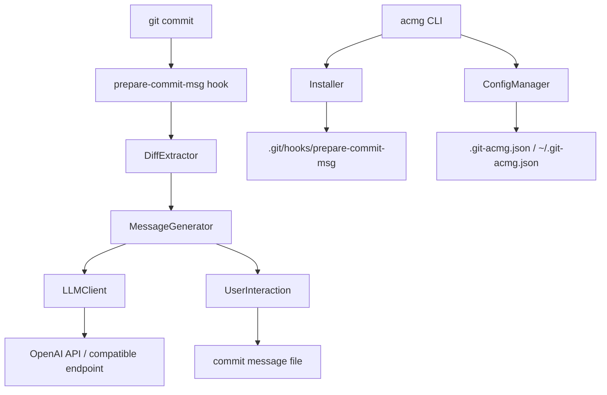

# Design Document: Auto Commit Message Generator

## Overview

The auto-commit-message-generator (`acmg`) is a CLI tool and git hook integration that automatically generates commit messages from staged changes using a language model. It intercepts the `prepare-commit-msg` git hook, extracts the staged diff, sends it to an LLM (defaulting to OpenAI's `gpt-4o-mini`), and presents the generated message to the developer for acceptance, editing, or rejection.

The tool is designed to be non-invasive: it never blocks a commit, degrades gracefully on API failures, and respects existing hook scripts. Configuration is file-based (`.git-acmg.json`) with a global fallback, making it portable across machines and repositories.

### Key Design Goals

- **Non-blocking**: Any failure (API error, timeout, missing key) falls through to normal git behavior
- **Composable**: Appends to existing hooks rather than replacing them
- **Configurable**: Per-repo and global config with clear precedence rules
- **Testable**: Pure functions for diff truncation, prompt construction, message validation, and config merging
- **Python-native**: Implemented in Python 3.10+, distributed as a pip-installable package (`acmg`)

---

## Architecture

The system is composed of four main layers:



**Components:**

| Component | Responsibility |
|---|---|
| `DiffExtractor` | Runs `git diff --cached`, handles empty diffs, truncates to token limit |
| `MessageGenerator` | Constructs the prompt, calls `LLMClient`, validates the response |
| `LLMClient` | HTTP client for OpenAI Chat Completions API with timeout and auth |
| `UserInteraction` | Displays message, prompts accept/edit/discard, handles CI mode |
| `Installer` | Installs/uninstalls the hook, manages hook file content |
| `ConfigManager` | Reads, merges, and writes config files |
| `acmg CLI` | Entry point for `install`, `uninstall`, and `config set` subcommands |

---

## Components and Interfaces

### DiffExtractor

Responsible for running `git diff --cached` and preparing the diff for the prompt.

```python
from dataclasses import dataclass

@dataclass
class DiffResult:
    diff: str           # raw unified diff text
    is_empty: bool      # True when no files are staged
    was_truncated: bool

class DiffExtractor:
    def extract_staged_diff(self) -> DiffResult: ...
    def truncate_diff(self, diff: str, max_tokens: int) -> str: ...
```

**Truncation strategy**: When the diff exceeds `max_tokens`, the extractor splits the diff into hunks and greedily includes hunks from the end of the diff (most recently changed) until the token budget is exhausted. A header comment is prepended to the truncated diff to inform the model that the diff was cut.

**Token estimation**: Approximate token count using `ceil(len(diff) / 4)` — a conservative estimate that avoids a full tokenizer dependency.

---

### MessageGenerator

Constructs the prompt and orchestrates the LLM call.

```python
from dataclasses import dataclass, field

@dataclass
class GenerationResult:
    message: str
    success: bool
    error: str | None = None

@dataclass
class ValidationResult:
    valid: bool
    subject_line: str
    body: str | None = None
    errors: list[str] = field(default_factory=list)

class MessageGenerator:
    def generate(self, diff: str, config: ResolvedConfig) -> GenerationResult: ...
    def build_prompt(self, diff: str, config: ResolvedConfig) -> tuple[str, str]: ...
    def validate_message(self, message: str) -> ValidationResult: ...
```

`build_prompt` returns a `(system_message, user_message)` tuple.

**Prompt construction** includes:
- System instruction: role, output format, conventional commits toggle, imperative mood requirement
- User message: the diff content
- Explicit constraints: subject ≤72 chars, no trailing period, blank line before body

---

### LLMClient

Thin HTTP wrapper around the OpenAI Chat Completions API.

```python
from dataclasses import dataclass

@dataclass
class LLMPrompt:
    system_message: str
    user_message: str

@dataclass
class LLMResponse:
    content: str
    success: bool
    error: str | None = None
    timed_out: bool = False

class LLMClient:
    def complete(self, prompt: LLMPrompt, config: ResolvedConfig) -> LLMResponse: ...
```

The client uses [`httpx`](https://www.python-httpx.org/) with a 15-second `timeout` parameter. The base URL defaults to `https://api.openai.com/v1` but is overridable via config for local/alternative models. Alternatively, the official [`openai`](https://pypi.org/project/openai/) Python SDK can be used directly, which handles auth, retries, and base URL configuration out of the box.

---

### UserInteraction

Handles terminal I/O for the accept/edit/discard prompt.

```python
from typing import Literal

UserChoice = Literal['accept', 'edit', 'discard']

class UserInteraction:
    def prompt_user(self, message: str) -> UserChoice: ...
    def is_interactive(self) -> bool: ...
    def write_commit_message(self, file_path: str, message: str) -> None: ...
```

**CI detection**: `is_interactive()` returns `False` when `sys.stdin.isatty()` is `False`, or when `CI`, `GITHUB_ACTIONS`, or similar environment variables are set, or when `auto_accept` is `True` in config.

---

### Installer

Manages the `prepare-commit-msg` hook file.

```python
class Installer:
    def install(self, repo_root: str) -> None: ...
    def uninstall(self, repo_root: str) -> None: ...
    def is_git_repository(self, directory: str) -> bool: ...
```

The installer wraps its injected lines with sentinel comments:
```sh
# BEGIN acmg
acmg hook "$1" "$2" "$3"
# END acmg
```

This allows `uninstall` to surgically remove only those lines without touching other hook content.

---

### ConfigManager

Reads, merges, and writes configuration.

```python
from dataclasses import dataclass
from typing import Literal

ConfigKey = Literal['apiKey', 'model', 'baseUrl', 'maxTokens', 'autoAccept', 'conventionalCommits']

@dataclass
class ResolvedConfig:
    api_key: str | None = None
    model: str = 'gpt-4o-mini'
    base_url: str = 'https://api.openai.com/v1'
    max_tokens: int = 8000
    auto_accept: bool = False
    conventional_commits: bool = True

class ConfigManager:
    def load(self, repo_root: str) -> ResolvedConfig: ...
    def set(self, key: ConfigKey, value: str, repo_root: str) -> None: ...
```

---

## Data Models

### Config File Schema (`.git-acmg.json`)

```json
{
  "apiKey": "sk-...",
  "model": "gpt-4o-mini",
  "baseUrl": "https://api.openai.com/v1",
  "maxTokens": 8000,
  "autoAccept": false,
  "conventionalCommits": true
}
```

All fields are optional. Unknown keys trigger a stderr warning but do not cause failure.

### Config Merge Precedence (highest → lowest)

1. Repository-level `.git-acmg.json`
2. Global `~/.git-acmg.json`
3. Built-in defaults

### Commit Message Format

```
<type>(<scope>): <description>
                                  ← blank line (when body present)
<optional body>
```

- `type`: one of `feat`, `fix`, `docs`, `style`, `refactor`, `test`, `chore`
- `scope`: optional, parenthesized
- `description`: imperative mood, ≤72 chars total for subject line, no trailing period
- When `conventionalCommits: false`, the `<type>(<scope>):` prefix is omitted

### Hook Invocation

The `prepare-commit-msg` hook receives three arguments from git:
1. `$1` — path to the commit message file
2. `$2` — source of the commit message (`message`, `template`, `merge`, `squash`, `commit`)
3. `$3` — commit SHA (only for `--amend`)

The hook only runs the generator when `$2` is empty or `message` (i.e., not during merges, squashes, or amends).

---

## Correctness Properties

*A property is a characteristic or behavior that should hold true across all valid executions of a system — essentially, a formal statement about what the system should do. Properties serve as the bridge between human-readable specifications and machine-verifiable correctness guarantees.*

---

### Property 1: Diff truncation fits within token limit

*For any* unified diff string and any positive `maxTokens` value, calling `truncateDiff(diff, maxTokens)` SHALL produce a result whose estimated token count is less than or equal to `maxTokens`, and the result SHALL consist only of hunks that appeared in the original diff (no invented content).

**Validates: Requirements 1.4**

---

### Property 2: Prompt construction reflects config

*For any* diff string and config object, `buildPrompt(diff, config)` SHALL:
- Always include an imperative mood instruction in the system message
- Include the conventional commits format specification (`<type>(<scope>): <description>`) when `conventionalCommits` is `true`
- Omit the conventional commits format specification when `conventionalCommits` is `false`
- Always include the diff content in the user message

**Validates: Requirements 2.2, 2.4, 7.1, 7.2**

---

### Property 3: Message validation enforces format rules

*For any* commit message string, `validateMessage(message)` SHALL:
- Return `valid: false` when the subject line exceeds 72 characters
- Return `valid: false` when the subject line ends with a period
- Return `valid: false` when a body is present but there is no blank line separating it from the subject
- Return `valid: true` when all format rules are satisfied

**Validates: Requirements 2.3, 7.3, 7.4**

---

### Property 4: Config merge respects precedence

*For any* combination of repo-level config object and global config object (either or both may be absent), `mergeConfigs(repoConfig, globalConfig)` SHALL produce a resolved config where:
- Every key present in the repo-level config has the repo-level value
- Keys absent from the repo-level config but present in the global config have the global value
- Keys absent from both configs have the built-in default value

**Validates: Requirements 6.1, 6.2, 6.3**

---

### Property 5: Config set round-trip

*For any* valid config key and any string value, after calling `configManager.set(key, value, repoRoot)`, a subsequent call to `configManager.load(repoRoot)` SHALL return a config where that key equals the written value.

**Validates: Requirements 6.4**

---

### Property 6: Hook install preserves existing content

*For any* existing `prepare-commit-msg` hook file content, after `installer.install(repoRoot)`, the resulting hook file SHALL contain the original content AND the acmg sentinel block (`# BEGIN acmg` … `# END acmg`).

**Validates: Requirements 5.2**

---

### Property 7: Hook install/uninstall round-trip

*For any* existing `prepare-commit-msg` hook file content, calling `installer.install(repoRoot)` followed by `installer.uninstall(repoRoot)` SHALL restore the hook file to exactly its original content.

**Validates: Requirements 5.4**

---

### Property 8: API request timeout is always enforced

*For any* LLM request, the HTTP request issued by `LLMClient.complete()` SHALL have an `httpx.Timeout` of exactly 15.0 seconds, regardless of the config or prompt content.

**Validates: Requirements 3.4**

---

### Property 9: API key resolution follows precedence

*For any* combination of `OPENAI_API_KEY` environment variable (set/unset) and config `apiKey` (set/unset), the resolved API key used by `LLMClient` SHALL be: the environment variable value if set, otherwise the config value if set, otherwise `undefined`.

**Validates: Requirements 3.1**

---

### Property 10: Non-interactive environments auto-accept

*For any* generated commit message and any environment where `isInteractive()` returns `false` (TTY absent, CI env var set, or `autoAccept: true` in config), the commit message file SHALL be written with the generated message without any user prompt being displayed.

**Validates: Requirements 4.6**

---

## Error Handling

### API Key Missing

When no API key is found in the environment or config, the system prints a descriptive error to stderr (including instructions on how to set the key) and exits with code 1. The git commit is not blocked — git will open the editor with an empty message.

### LLM Timeout or Error

When the LLM call times out (after 15 seconds) or returns an HTTP error, the `MessageGenerator` logs the error to stderr and returns `success: false`. The hook then exits cleanly, allowing git to proceed with an empty or user-provided message.

### Empty Diff

When `git diff --cached` returns no output, `DiffExtractor` sets `isEmpty: true`. The hook exits immediately without calling the generator. This is the normal behavior when `git commit` is run with nothing staged.

### Non-Git Directory

When `acmg install` or `acmg uninstall` is run outside a git repository, the `Installer` checks for the `.git` directory, prints a descriptive error to stderr, and exits with code 1.

### Unrecognized Config Keys

When a config file contains keys not in the supported set, `ConfigManager` logs a warning to stderr for each unrecognized key and continues loading the recognized keys. This prevents silent misconfiguration.

### Hook Source Type

The hook only runs the generator when the commit source (`$2`) is empty or `message`. It skips generation for `merge`, `squash`, `commit` (amend), and `template` sources to avoid interfering with those workflows.

---

## Testing Strategy

### Approach

The testing strategy uses a dual approach:
- **Unit/property tests** for pure functions (diff truncation, prompt construction, message validation, config merging, hook content manipulation)
- **Integration tests** for I/O-bound operations (git invocation, file system, HTTP calls)

### Property-Based Testing

The feature has several pure functions with well-defined universal properties, making it well-suited for property-based testing.

**Library**: [Hypothesis](https://hypothesis.readthedocs.io/) (Python)

**Configuration**: Minimum 100 iterations per property test via `@settings(max_examples=100)`.

**Tag format**: `# Feature: auto-commit-message-generator, Property {N}: {property_text}`

Each correctness property maps to a single property-based test:

| Property | Test | Hypothesis Strategies |
|---|---|---|
| P1: Diff truncation | `st.text()` for diff content, `st.integers(min_value=100)` for max_tokens | Verify token count ≤ max_tokens |
| P2: Prompt construction | `st.text()` for diff, `st.booleans()` for conventional_commits | Verify prompt content |
| P3: Message validation | `st.text()` for message content | Verify validation rules |
| P4: Config merge precedence | `st.fixed_dictionaries(...)` for repo and global configs | Verify merge result |
| P5: Config set round-trip | `st.sampled_from(config_keys)`, `st.text()` for value | Verify read-back |
| P6: Hook install preserves content | `st.text()` for existing hook content | Verify content preserved |
| P7: Hook install/uninstall round-trip | `st.text()` for existing hook content | Verify exact restoration |
| P8: Timeout always enforced | `st.fixed_dictionaries(...)` for any config/prompt | Verify httpx timeout=15.0 |
| P9: API key precedence | `st.one_of(st.none(), st.text())` for env var and config key | Verify resolution order |
| P10: Non-interactive auto-accept | `st.text()` for message, `st.booleans()` for CI flags | Verify no prompt shown |

### Unit Tests

Unit tests cover specific examples and error conditions not captured by properties:

- Empty diff → generator not invoked (Req 1.2)
- LLM error → stderr log + graceful exit (Req 2.5)
- Missing API key → descriptive error + non-zero exit (Req 3.2)
- Non-git directory → descriptive error + non-zero exit (Req 5.5)
- Unrecognized config key → warning logged, recognized keys loaded (Req 6.5)
- Hook file made executable after install (Req 5.3)
- User accept → message written to file (Req 4.3)
- User edit → file pre-populated, editor opened (Req 4.4)
- User discard → file left empty (Req 4.5)

### Integration Tests

Integration tests verify end-to-end behavior with real git repositories and mocked HTTP:

- Stage a file, run hook, verify diff is captured (Req 1.1, 1.3)
- Mock OpenAI endpoint, run full hook flow, verify message written (Req 3.3)
- `acmg install` in a temp git repo, verify hook file created (Req 5.1)

### Test File Structure

```
src/
  acmg/
    __init__.py
    diff_extractor.py
    message_generator.py
    llm_client.py
    user_interaction.py
    installer.py
    config_manager.py
    cli.py
tests/
  unit/
    test_diff_extractor.py
    test_message_generator.py
    test_llm_client.py
    test_user_interaction.py
    test_installer.py
    test_config_manager.py
  property/
    test_diff_truncation_property.py
    test_prompt_construction_property.py
    test_message_validation_property.py
    test_config_merge_property.py
    test_hook_content_property.py
    test_api_client_property.py
  integration/
    test_git_hook_integration.py
    test_installer_integration.py
pyproject.toml
```

**Test runner**: `pytest` with the `pytest-hypothesis` profile for property tests. Dependencies managed via `pyproject.toml` using `[project.optional-dependencies]` or a `dev` extras group.
